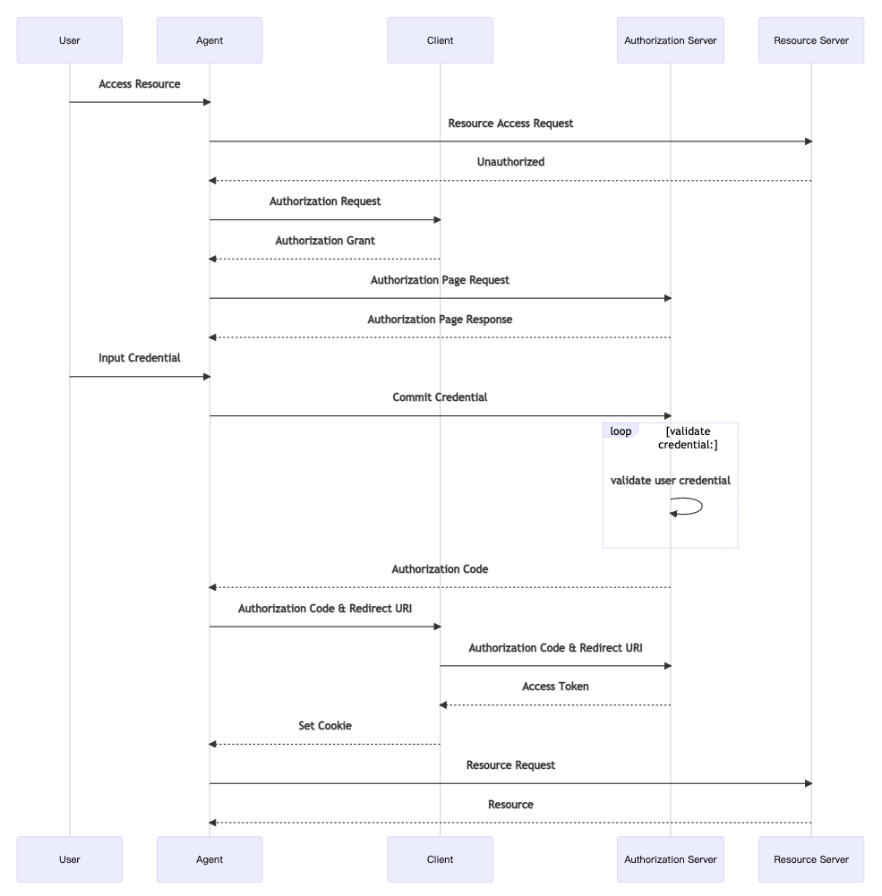

参考：https://segmentfault.com/a/1190000041093435

## OAuth2授权

### 1. 授权码模式

#### 1.1 问题

- 在第三方client请求授权的过程中，如果没有OAuth2，那么只能通过明文密码登录拿到登录态，而且会获取登录态下全部权限，很不安全。
- 第三方client有些具有后端，有些是公开的，对于这些情况需要有不同的模式
- 如果只有一步授权，容易被拦截攻击，同时无法控制授权范围，无法要求用户确认

#### 1.2 授权码模式

- 两步授权：先获取code，再获取token

- **授权码拦截攻击**：anthorize endpoint和token endpoint必须使用TLS，但是授权服务器携带授权码code返回到客户端的回调地址时，有可能不受TLS 的保护，容易被恶意程序拦截。对于有后端的client来说，请求token需要client_secret，不受影响；但是对于公开client，比如手机客户端，可以反编译拿到client_secret，因此会被攻击
  - state参数可以防止CSRF攻击，不能防止授权码拦截攻击
  - **PKCE**：anthorize endpoint需要额外的`code_challenge`和`code_challenge_method`（plain或者S256）参数，token endpoint需要额外的`code_verifier`参数，颁发token时需要验证code_challenge == code_challenge_method(code_verifier)，验证通过才下发token