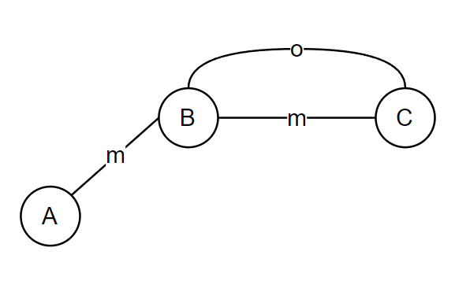

### leetcode必刷题
#### 1. 参考
http://www.cyc2018.xyz/

- idea leetcode插件：

  - CodeFileName：

    ```
    $!velocityTool.camelCaseName(${question.titleSlug})
    ```

  - CodeTemplate：

    ```
    package leetcode.editor.cn;
    
    // 题目编号：${question.frontendQuestionId}
    ${question.content}
    public class $!velocityTool.camelCaseName(${question.titleSlug}){
        public static void main(String[] args) {
            Solution solution = new $!velocityTool.camelCaseName(${question.titleSlug})().new Solution();
        }
        
        ${question.code}
    }
    ```

#### 2. 题号

1. 全部

   ```
   1, 3, 8, 9, 15, 17, 19, 20, 21, 24, 31, 34, 37, 39, 40, 42, 43, 46, 47, 50, 51, 53, 55, 62, 64, 67, 69, 70, 72, 75, 77, 78, 79, 83, 84, 88, 90, 91, 93, 94, 95, 101, 104, 108, 109, 110, 111, 112, 113, 121, 122, 123, 127, 128, 130, 131, 136, 139, 141, 142, 144, 145, 147, 153, 155, 160, 162, 165, 167, 168, 169, 172, 179, 188, 189, 190, 198, 200, 204, 205, 206, 207, 208, 210, 213, 215, 216, 217, 224, 225, 226, 230, 231, 232, 234, 235, 236, 238, 240, 241, 242, 257, 260, 268, 278, 279, 283, 287, 292, 300, 303, 309, 316, 318, 322, 326, 328, 337, 338, 342, 343, 345, 347, 367, 371, 376, 377, 378, 392, 404, 405, 406, 409, 413, 415, 416, 417, 435, 437, 442, 451, 452, 455, 461, 462, 470, 474, 476, 485, 494, 496, 501, 503, 504, 513, 518, 524, 530, 538, 540, 543, 547, 560, 565, 566, 567, 572, 583, 594, 605, 617, 628, 633, 637, 645, 646, 647, 650, 662, 665, 667, 669, 671, 677, 680, 684, 687, 693, 695, 696, 697, 714, 725, 739, 743, 744, 763, 766, 769, 785, 1091, 1143
   ```

2. 依分类

   - 双指针：15, 88, 165, 167, 345, 524, 633, 680
   - 排序：75, 179, 215, 347, 451
   - 贪心：55, 122, 392, 406, 435, 452, 455, 605, 665, 763
   - 二分：34, 69, 153, 162, 278, 540, 744
   - 分治：95, 241
   - 搜索：17, 31, 37, 39, 40, 46, 47, 51, 77, 78, 79, 90, 93, 127, 130, 131, 200, 216, 257, 279, 417, 547, 695, 1091
   - 动态规划：42, 53, 62, 64, 70, 72, 91, 121, 123, 139, 188, 198, 213, 279, 300, 303, 309, 322, 343, 376, 377, 413, 416, 474, 494, 518, 583, 646, 650, 714, 1143
   - 数学：50, 67, 168, 169, 172, 204, 238, 292, 326, 367, 405, 415, 462, 470, 504, 628
   - 链表：19, 21, 24, 83, 141, 142, 147, 160, 206, 234, 328, 725
   - 树：94, 101, 104, 108, 109, 110, 111, 112, 113, 144, 145, 208, 226, 230, 235, 236, 337, 404, 501, 513, 530, 538, 543, 572, 617, 637, 653, 662, 669, 671, 677, 687
   - 栈和队列：20, 155, 225, 232, 503
   - 哈希表：1, 128, 217, 594
   - 字符串：9, 205, 242, 409, 647, 696
   - 数组与矩阵：43, 189, 240, 283, 287, 378, 442, 485, 565, 566, 645, 667, 697, 766, 769
   - 图：207, 210, 684, 785
   - 位运算：136, 190, 231, 260, 268, 318, 338, 342, 371, 461, 476, 693
   - 单调栈：84, 316, 496, 739
   - 滑动窗口：3, 567
   - 前缀和：437, 560

3. SQL

   ```
   175, 176, 177, 178, 180, 181, 182, 183, 184, 196, 595, 596, 620, 626, 627
   ```


#### 3. 常用数据结构及写法

##### 3.1 栈/队列

###### 3.1.1 普通栈/队列

- java推荐使用Deque来实现栈和队列，Deque拥有两套API。其一为add/remove/element，会抛出异常，其二为offer/poll/peek，会返回特殊值，常用的为第一套。
- add相当于addLast，push相当于addFirst，remove和pop均相当于removeFirst，element相当于getFirst。因此当做栈来使用时，用push/pop/element或者addLast/removeLast/getLast；当做队列来使用时用add/remove/element。
- addLast/removeLast/getLast可以保证一个栈内的元素用new ArrayList<>(deque)转换后是正向打印出来的。适合backtrack或者dfs等场合要保存路径时应用。

###### 3.1.2 单调栈

- 递减栈用于寻找下一个更大元素，或上一个更大元素（逆序扫描）；

   同理，递增栈用于寻找下一个更小元素，或上一个更小元素（逆序扫描）。

   ```java
   // lc 496
   public int[] nextGreaterElement(int[] nums1, int[] nums2) {
       Map<Integer, Integer> nextGreaterElementMap = new HashMap<>();
   
       Deque<Integer> decreasingStack = new ArrayDeque<>();
       for (int num : nums2) {
           // 注意此处为while循环，且判断栈顶元素小于当前当前元素时出栈保证递减
           // 出栈元素的下一个更大元素即为当前元素
           while (!decreasingStack.isEmpty() && decreasingStack.element() < num) {
               nextGreaterElementMap.put(decreasingStack.pop(), num);
           }
           decreasingStack.push(num);
       }
   
       int[] result = new int[nums1.length];
       for (int i = 0; i < nums1.length; i++) {
           result[i] = nextGreaterElementMap.getOrDefault(nums1[i], -1);
       }
       return result;
   }
   ```
   
   - 在应用单调栈时，有一些变种问题显得不是十分容易理解，如下：
   
     - [柱状图中最大的矩形](https://leetcode-cn.com/problems/largest-rectangle-in-histogram/)：本题关键在于找到第一个比当前柱子小的柱子时，可以确定两者之间以某个柱子对应的最大矩形；如果柱子等高，直接去掉等高的柱子即可，因为他们对应的最大矩形一样；同时我们可以添加两个哨兵（高度为0的柱子），这样不用去判断栈为空的情况。
     
     - [去除重复字母](https://leetcode-cn.com/problems/remove-duplicate-letters/)：本题使用递增栈来保证栈内元素字典序最小，关键在于记录重复元素最后一次出现的位置和访问记录。元素已经在栈中直接跳过，如果遍历过程中某栈顶元素不是最后一次出现且不满足递增栈性质，就将其移除出栈。

##### 3.2 堆

###### 3.2.1 堆本质

- 堆本质上讲就是一个完全二叉树，一般用数组来实现，可以方便的通过数组序号来定位堆节点。满足任意节点小于（或大于）它的所有后裔，最小元（或最大元）在堆的根上。

- heapify：建堆。heapify时间复杂度为O(n)，就是节点的总交换次数，等于每层的节点数乘以每个节点最多交换的次数，可以由等比数列求和推导出来。

  - siftDown：核心操作，以最大堆为例，为从root节点开始，依次将其与子节点比较，如果小于则交换值，接着递归的比较子节点。由于建堆操作通常是自底向上的，这样可以使root节点值保持最大。

- 经典问题：topK

  - 要取前K个最大值，典型思路就是建一个最大堆，将所有元素add入堆，最后remove出前K个，但是这样容易耗空间；因此也可以建容量为k的最小堆，add和remove同时用，动态的得到topK，但是这样执行了更多的remove操作。
  - topK问题也可以用快排的思路来解决

- 原理实现如下，工程中java实际使用PriorityQueue：

  ```java
  private void heapify(int[] nums, int heapSize) {
      for (int i = heapSize / 2; i >= 0; i--) {
          siftDown(nums, i, heapSize);
      }
  }
  
  private void siftDown(int[] nums, int root, int heapSize) {
      int l = 2 * root + 1, r = 2 * root + 2, largest = root;
      if (l < heapSize && nums[l] > nums[largest]) {
          largest = l;
      }
      if (r < heapSize && nums[r] > nums[largest]) {
          largest = r;
      }
      if (largest != root) {
          swap(nums, root, largest);
          siftDown(nums, largest, heapSize);
      }
  }
  ```

##### 3.3 二叉树

###### 3.3.1 各种遍历的非递归写法

- 先序遍历

  ```java
  public void preOrder(TreeNode root) {
      Deque<TreeNode> stack = new ArrayDeque<>();
      while (root != null || !stack.isEmpty()) {
          while (root != null) {
              /* do sth. about root.val */
  
              //先访问再入栈
              stack.push(root);
              root = root.left;
          }
          //如果是null，出栈并处理右子树
          root = stack.pop().right;
      }
  }
  ```

- 中序遍历

  ```java
  // 跟上述区别是先入栈再访问，会了一个很快就会另一个
  public void inOrder(TreeNode root) {
      Deque<TreeNode> stack = new ArrayDeque<>();
      while (root != null || !stack.isEmpty()) {
          while (root != null) {
              stack.push(root);
              root = root.left;
          }
          
          root = stack.pop();
          /* do sth. about root.val */
  
          root = root.right;
      }
  }
  ```

- 后序遍历

  ```java
  public void postOrder(TreeNode root) {
      Deque<TreeNode> stack = new ArrayDeque<>();
      TreeNode pre = null;
      while (!stack.isEmpty() || root != null) {
          while (root != null) {
              stack.push(root);
              root = root.left;
          }
          root = stack.pop();
          // 右子树存在 && 未访问过
          if (root.right != null && root.right != pre) {
              // 重复压栈以记录当前路径分叉节点
              stack.push(root);
              root = root.right;
          } else {
              // 此时node的左右子树应均已完成访问
              /* do sth. about root.val */
  
              // 避免重复访问右子树
              pre = root;
              // 避免重复访问左子树
              root = null;
          }
      }
  }
  ```

##### 3.4 并查集

###### 3.4.1 定义

- // TODO

  ```java
  class UnionFind {
      private int count;
      // (cur, leader)
      private Map<Integer, Integer> parent;
  
      public UnionFind(int[] nums) {
          count = nums.length;
          parent = new HashMap<>();
          for (int v : nums) {
              // 初始时，各自为战，自己是自己的领队
              parent.put(v, v);
          }
      }
  
      // 结盟
      public void union(int p, int q) {
          // 不只是 p 与 q 结盟，而是整个 p 所在队伍 与 q 所在队伍结盟
          // 结盟需各领队出面，而不是小弟出面
          Integer rootP = find(p), rootQ = find(q);
          if (rootP == rootQ) {
              return;
          }
          if (rootP == null || rootQ == null) {
              return;
          }
  
          // 结盟，谁大听谁
          parent.put(rootP, rootQ);
          // 应取 max，而本题已明确 p < q 才可这么写
          // 当前写法有损封装性，算法题可不纠结
  
          count--;
      }
  
      // 查找领队
      public Integer find(int p) {
          if (!parent.containsKey(p)) {
              return null;
          }
  
          // 递归向上找领队
          int root = p;
          while (root != parent.get(root)) {
              root = parent.get(root);
          }
  
          // 路径压缩：扁平化管理，避免日后找领队层级过深
          while (p != parent.get(p)) {
              int curr = p;
              p = parent.get(p);
              parent.put(curr, root);
          }
  
          return root;
      }
  }
  ```

  - [最长连续序列](https://leetcode-cn.com/problems/longest-consecutive-sequence/)：本题除了hashmap，dp还可以用并查集。


##### 3.5 哈希表

###### 3.5.1 普通哈希表

- 本身没啥好说的，空间换时间的哈希表

###### 3.5.2 滑动窗口

- 结构如下

  ```java
  // 窗口开始位置
  int start = 0;
  // key为元素值，字符串的话就是某字符；value为元素位置
  Map<Character, Integer> window = new HashMap<>();
  ```

  - 在遍历字符串时，当前位置与开始位置的距离就是窗口大小，start可以被动态更新，更新语句如下：

    ```java
    start = Math.max(window.get(s.charAt(i)) + 1, start);
    ```

- 典型题1：[无重复字符的最长子串](https://leetcode-cn.com/problems/longest-substring-without-repeating-characters/)

  ```java
  public int lengthOfLongestSubstring(String s) {
      int start = 0, res = 0;
      Map<Character, Integer> window = new HashMap<>();
      for (int i = 0; i < s.length(); i++) {
          if (window.containsKey(s.charAt(i))) {
              start = Math.max(window.get(s.charAt(i)) + 1, start);
          }
          window.put(s.charAt(i), i);
          res = Math.max(res, i - start + 1);
      }
      return res;
  }
  ```

#### 4. 常用算法模板

##### 4.1 排序

###### 4.1.1 堆排序

​	堆定义见[3.2 堆](#3.2 堆)

- ```java
  // 从小到大排序，建最大堆
  public int[] heapSort(int[] nums) {
      int heapSize = nums.length;
      heapify(nums, heapSize);
      for (int i = nums.length - 1; i >= 0; i--) {
          // 将最大元素挪至结尾
          swap(nums, 0, i);
          heapSize--;
          // 保证堆顶元素的最大
          siftDown(nums, 0, heapSize);
      }
      return nums;
  }
  ```

###### 4.1.2 快速排序

​		快速排序采用分治的思想，每一次partition将一个pivot的放到其正确的位置上，随后递归的处理左右两半。partition函数使用双指针处理pivot并最终返回其正确序号。

- ```java
  private void quickSort(int[] a, int left, int right) {
      if (left >= right) {
          return;
      }
      int index = partition(a, left, right);
      quickSort(a, left, index - 1);
      quickSort(a, index + 1, right);
  }
  
  private int partition(int[] a, int left, int right) {
      int randomI = random.nextInt(right - left + 1) + left;
      swap(a, randomI, right);
  
      int pivot = a[right];
      int i = left - 1, j = left;
      // all in [0, i] <= pivot
      while (j < right) {
          if (a[j] <= pivot) {
              swap(a, ++i, j);
          }
          j++;
      }
      swap(a, i + 1, right);
      return i + 1;
  }
  ```
  
  - partition函数的另一个典型用法是[荷兰国旗问题](https://leetcode-cn.com/problems/sort-colors/)，比快排中的partition多了一个指针，将数组分为三个区间，解法如下：
  
    ```java
    public void sortColors(int[] nums) {
        int p0 = 0, p2 = nums.length;
        int i = 0;
        
        // all in [0, p0) = 0
        // all in [p0, i) = 1
        // all in [p2, len - 1] = 2
        while (i < p2) {
            if (nums[i] == 0) {
                swap(nums, i++, p0++);
            } else if (nums[i] == 1) {
                i++;
            } else {
                swap(nums, i, --p2);
            }
        }
    }
    ```
  
    

###### 4.1.3 归并排序

​		归并排序同样为分治的思想，只是每次将左右两边的subList排序好，最后通过merge两个有序的subList得到最终结果。

- 对数组的归并简单的方法是建立一个新数组进行copy，核心方法如下：

  ```java
  private void mergeSort(int[] nums, int left, int right) {
      int mid = left + (right - left) / 2;
      if (left < right) {
          mergeSort(nums, left, mid);
          mergeSort(nums, mid + 1, right);
          merge(nums, left, mid, right);
      }
  }
  
  private void merge(int[] nums, int left, int mid, int right) {
      int[] temp = new int[right - left + 1];
      int i = left, j = mid + 1, k = 0;
      while (i <= mid && j <= right) {
          if (nums[i] < nums[j]) {
              temp[k++] = nums[i++];
          } else {
              temp[k++] = nums[j++];
          }
      }
      while (i <= mid) {
          temp[k++] = nums[i++];
      }
      while (j <= right) {
          temp[k++] = nums[j++];
      }
  
      System.arraycopy(temp, 0, nums, left, temp.length);
  }
  ```

- merge in place方法如下：

  ```java
  // TODO：添加原理
  private void merge(int[] nums, int left, int mid, int right) {
      int i = left, j = mid + 1;
      while (i < j && j <= right) {
          while (i < j && nums[i] <= nums[j]) {
              i++;
          }
          int index = j;
          while (j <= right && nums[j] <= nums[i]) {
              j++;
          }
          swapAdjacentBlocks(nums, i, index - i, j - index);
          i += (j - index);
      }
  }
  
  private void swapAdjacentBlocks(int arr[], int bias, int oneSize, int anotherSize) {
      reverse(arr, bias, bias + oneSize - 1);
      reverse(arr, bias + oneSize, bias + oneSize + anotherSize - 1);
      reverse(arr, bias, bias + oneSize + anotherSize - 1);
  }
  ```

##### 4.2 搜索

###### 4.2.1 二分

- 选择搜索区：二分搜索关键在于通过mid值与low值或high值的比较，确定要搜索的目标值在list的哪边，如果没法确定则无法搜索。

  - 标准二分如下，能准确找到target值，搜索条件为l <= h：

    ```java
    while (l <= h) {
        int m = l + (h - l) / 2;
        if (nums[m] == key) {
            return m;
        } else if (nums[m] > key) {
            h = m - 1;
        } else {
            l = m + 1;
        }
    }
    ```

  - 若选择搜索区时需要保留mid值，则循环结束时low一定等于high：

      ```java
      // 循环结束时low一定等于high
      while (low < high) {
          int mid = low + (high - low) / 2;
          if (.....) {
              high = mid;
          } else {
              low = mid + 1;
          }
      }
      ```

  - 还有一些要求另类的，比如第一个大于target的数：

      ```java
      // res初始化为nums.length是因为可能数组中所有数字都比target小
      int low = 0, high = nums.length - 1, res = nums.length;
      while (left <= right) {
          int mid = low + (high - low) / 2;
          if (nums[mid] > target) {
              right = mid - 1;
              // 其实跟标准二分一样，只是在循环过程中记录结果
              res = mid;
          } else {
              left = mid + 1;
          }
      }
      ```

      

- 搜索条件，二分的搜索条件至关重要，不同的搜索条件决定了能不能确定搜索区，一些特殊的搜索条件如下：

  - lc 162，[寻找峰值](https://leetcode-cn.com/problems/find-peak-element/)：条件为 nums[mid] > nums[mid + 1]。
  - lc 153，[寻找旋转排序数组中的最小值](https://leetcode-cn.com/problems/find-minimum-in-rotated-sorted-array/)：条件为 nums[mid] < nums[high]。详细解释见：https://leetcode-cn.com/problems/find-minimum-in-rotated-sorted-array/solution/er-fen-cha-zhao-wei-shi-yao-zuo-you-bu-dui-cheng-z/

###### 4.2.2 backtrack

- backtrack本质上是一种dfs，不同之处在于**dfs通常解决可达性问题，到出口了直接返回；backtrack通常解决排列组合问题，需保存中间结果，之后继续递归。**

  - 所以进入下一层递归时，需要将某元素标记为访问过，而返回上一层递归时，需要将访问标记删除

  - 典型示例：lc 46，[全排列](https://leetcode-cn.com/problems/permutations/)

    ```java
    public List<List<Integer>> permute(int[] nums) {
        List<List<Integer>> res = new ArrayList<>();
        backtrack(res, nums, 0);
        return res;
    }
    
    // backtrack需要一个pos变量表示当前位置，还需要一个队列来保存中间结果。本例中，nums是swap in place的，因此省略了这个队列
    private void backtrack(List<List<Integer>> res, int[] nums, int pos) {
        res.add(Arrays.stream(nums).boxed().collect(Collectors.toList()));
        for (int i = pos; i < nums.length; i++) {
            for (int j = i + 1; j < nums.length; j++) {
                // 进入下一层递归前改变中间结果
                swap(nums, i, j);
                // 注意backtrack进入下一层递归后pos一般为i+1,而不是pos+1
                backtrack(res, nums, i + 1);
                // 返回上一层递归前还原
                swap(nums, i, j);
            }
        }
    }
    ```
  
  - 典型示例2：lc 39，[组合总和](https://leetcode-cn.com/problems/combination-sum/)
  
    ```java
    public List<List<Integer>> combinationSum(int[] candidates, int target) {
        List<List<Integer>> res = new ArrayList<>();
        backtrack(candidates, target, res, 0, new ArrayDeque<>());
        return res;
    }
    
    private void backtrack(int[] candidates, int target, List<List<Integer>> res, int pos, Deque<Integer> deque) {
        if (target <= 0) {
            if (target == 0) {
                res.add(new ArrayList<>(deque));
            }
        } else {
            for (int i = pos; i < candidates.length; i++) {
                deque.addLast(candidates[i]);
                backtrack(candidates, target - candidates[i], res, i, deque);
                deque.removeLast();
            }
        }
    }
    ```
  

###### 4.2.3 dfs

- 典型示例1：[单词搜索](https://leetcode-cn.com/problems/word-search/)，是二维网格的一种典型dfs题，模板十分固定，如下所示：

  ```java
  public boolean exist(char[][] board, String word) {
      int[][] directions = new int[][]{{-1, 0}, {1, 0}, {0, 1}, {0, -1}};
      int m = board.length, n = board[0].length;
      boolean[][] visited = new boolean[m][n];
  
      for (int i = 0; i < m; i++) {
          for (int j = 0; j < n; j++) {
              if (dfs(board, m, n, i, j, word, 0, visited, directions)) {
                  return true;
              }
          }
      }
      return false;
  }
  
  private boolean dfs(char[][] board, int m, int n, int i, int j, String word, int k, boolean[][] visited, int[][] directions) {
      if (k == word.length()) {
          return true;
      }
      if (i < 0 || i >= m || j < 0 || j >= n || visited[i][j] || board[i][j] != word.charAt(k)) {
          return false;
      }
      visited[i][j] = true;
      for (int[] direction : directions) {
          if (dfs(board, m, n, i + direction[0], j + direction[1], word, k + 1, visited, directions)) {
              return true;
          }
      }
      visited[i][j] = false;
      return false;
  }
  ```


###### 4.2.4 bfs

- 与dfs区别只是搜索方式不一样：[岛屿数量](https://leetcode-cn.com/problems/number-of-islands/)

- 能解决的问题比较有限

  ```java
  private void bfs(char[][] grid, int m, int n, int i, int j, boolean[][] visited, int[][] directions) {
      Deque<Node> queue = new ArrayDeque<>();
      queue.add(new Node(i, j));
      visited[i][j] = true;
      while (!queue.isEmpty()) {
          Node node = queue.remove();
          // bfs这个visited无法回溯清除，只能解决某些问题，比如这个岛屿问题，无法应对单词搜索等问题，建议优先使用dfs
          visited[i][j] = false;
          for (int[] direction : directions) {
              int x = node.x + direction[0], y = node.y + direction[1];
              if (x < 0 || x >= m || y < 0 || y >= n || visited[x][y] || grid[x][y] != '1') {
                  continue;
              }
              grid[x][y] = '2';
              queue.add(new Node(x, y));
              visited[x][y] = true;
          }
      }
  }
  
  ```

  

##### 4.3 动态规划

###### 4.3.0 简介

- 动态规划问题需满足以下条件：

  - 最优化原理：一个最优化策略的子策略总是最优的。例如假设从A->B->C的最短路径是m->o，则根据最优化策略，从B->C的最短路径一定是o。可以通过反证法得以证明。

    

  - 无后效性：各个状态按照次序排好后，某个状态无法影响未来的状态，完全由之前的状态决定。由此可列出状态转移方程，进行动态规划求解。

  - 消除子问题的重叠性：动态规划将指数复杂度降维到多项式复杂度，是因为消除了很多重复的求解的子问题。这些子问题的结果往往需要一个中间数组保存，相当于是以空间换时间。

###### 4.3.1 数组

- 经典问题1：[最大子数组和](https://leetcode-cn.com/problems/maximum-subarray/)

  - 很容易想到使用一个数组保存各子问题结果的解法，如下：

    ```java
    public int maxSubArray(int[] nums) {
        int[] dp = new int[nums.length + 1];
        dp[0] = (int) -1e9;
        for (int i = 1; i <= nums.length; i++) {
            dp[i] = Math.max(nums[i - 1], dp[i - 1] + nums[i - 1]);
        }
        return Arrays.stream(dp).max().orElse(0);
    }
    ```

  - 观察发现虽然最终结果需要遍历数组，但是循环中dp[i]只受dp[i - 1]影响，因此可以用两个变量简化如下：

    ```java
    public int maxSubArray(int[] nums) {
        int res = Integer.MIN_VALUE;
        int preSum = (int) -1e9;
        for (int i = 0; i < nums.length; i++) {
            preSum = Math.max(nums[i], preSum + nums[i]);
            res = Math.max(res, preSum);
        }
        return res;
    }
    ```

- 经典问题2：股票问题系列

  - [买卖股票的最佳时机](https://leetcode-cn.com/problems/best-time-to-buy-and-sell-stock/)：只能买卖一次。跟最大子数组和差不多，区别是一个是preSum，这个是preMin。


###### 4.3.2 矩阵

- 矩阵部分的动态规划题往往是二维的。一些题目为二维网格只能向右或者向下移动，不难；更为典型的题目是[编辑距离](https://leetcode-cn.com/problems/edit-distance/)

​		

###### 4.3.3 HashMap

​		使用数组或者矩阵的dp题目是比较容易理解的，然而还有一些题目使用HashMap来进行dp。

- [最长连续序列](https://leetcode-cn.com/problems/longest-consecutive-sequence/)，本题的典型解法是使用HashMap不断更新右边界来压缩连续序列的路径，写法较容易。而使用HashMap进行dp的解法如下，较难理解：

  ```java
  public int longestConsecutive(int[] nums) {
      // key表示num，value表示num所在连续区间的长度
      Map<Integer, Integer> map = new HashMap<>();
  
      int res = 0;
      for (int num : nums) {
          // 当map中不包含num，也就是num第一次出现
          if (!map.containsKey(num)) {
              int left = map.getOrDefault(num - 1, 0);
              int right = map.getOrDefault(num + 1, 0);
              int curLen = left + right + 1;
              res = Math.max(res, curLen);
  
              // 将num加入map中，表示已经遍历过该值。其对应的value可以为任意值。
              map.put(num, -1);
  
              // 更新包含num在内的区间左右端点值的长度
              map.put(num - left, curLen);
              map.put(num + right, curLen);
          }
      }
      return res;
  }
  ```

  

